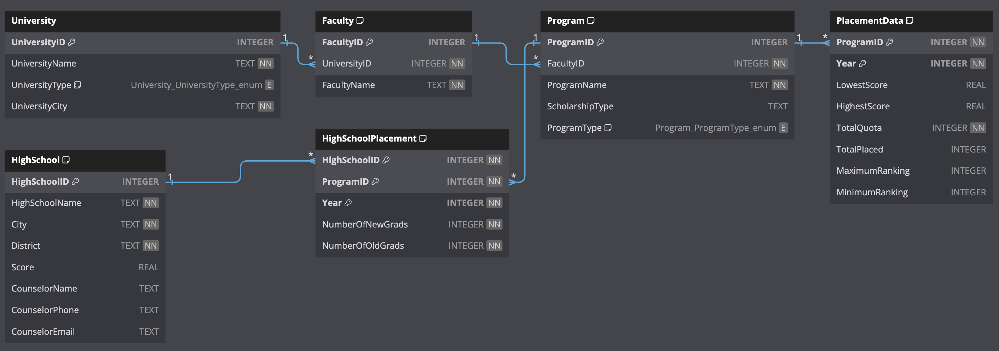

# Atlas Crawl 🧭

A [streamlit](https://streamlit.io/) based web scraping and data analytics dashboard for investigation of placement statistics across all universities in Turkey. This app is built specifically for Bilkent University's Information Office for Prospective Students ❤️.

Data is scraped from [YÖK Atlas](https://yokatlas.yok.gov.tr), a database supplied by Council of Higher Education of Turkey.

## Setup
**Requirements:**
- Python >=3.9
- Google Chrome installation 

First clone this repository to your local machine. Then create a virtual environment and install the required packages:
```bash
python3 -m virtualenv venv       # Create a virtual environment called 'venv'
source venv/bin/activate         # Activate the virtual environment
pip install -r requirements.txt  # Bulk install the required packages
```
This is a one time installation. Once you have created the virtual environment and installed all the packages you can simply run `source venv/bin/activate` to activate the environment and use the software. Once all of the requirements are installed, you can simply run the following command in `src` directory to get the analytics dashboard online.

```bash
streamlit run dashboard.py
```

Once you are done using the dashboard you can stop it pressing `Ctrl + C` in the terminal session. Use the command `deactivate` to deactivate the Python virtual environment.

## Data Crawling
Bear in mind that the crawled data and the university index is not shared in this repository! You'll need to create those yourself. The university index is just a set of program IDs designated by the Council of Higher Education. The tables on the site are generated on dynamically, therefore the scraping is done with the help of [selenium](https://www.selenium.dev/documentation/webdriver/). The pages are automatically surfed and the relevant tables are scraped and saved. 

The scraped data is stored in a [SQLite3](https://www.sqlite.org/docs.html) database. The schema for the database can be found in `src/schema.sql`. Here is a visualization of the database structure:


Before starting to crawl you need to create the database. This can be done with the help of a custom Python wrapper. Simply point the script to where you want to create the database:
```bash
python database.py <path/to/database.db>
```
After creating the database you can start crawling. In order to crawl you need to specify a year, a set of program IDs and the database file you just created. A sample command is:

```bash
python crawler.py 2023 ../data/programs_2023.txt -d ../data/crawl_database.db
```

The program IDs can be obtained from the Table4 published by Student Selection and Placement Centre ([ÖSYM](https://www.osym.gov.tr/)). Just download the table from SSPC's site (`Sınavlar > YKS > Kılavuzlar > Yükseköğretim Programları Ek Yerleştirme Kılavuzu ve Tablolar > Tablo-4`) and extract the program ids to a txt file. You can selectively choose which programs to crawl using this file. Currently CoHE website only has information down to 2019.

Crawled data integrity can be checked using the automated checks in `src/test.py`. Simply run:
```bash
python test.py <path/to/database.db>
```

This script checks uniqueness constraints of the database schema for duplicate data rejection and also does consistency checks like matching the number of students placed in a program and the `total_placed` attribute reported on the CoHE site. The database can be browsed using online tools like [SQLite Viewer Web App](https://sqliteviewer.app/) or local tools like [DB Browser for SQLite](https://sqlitebrowser.org/).


## Deploying to a Linux Server
In order to deploy the dashboard to a server you need to clone this repository to the server. Do the exact setup described above. Before running the dashboard, create a `screen` instance using:
```bash
screen -R dashboard
```
and then activate your virtual environment and run the dashboard. The connection details will be provided by streamlit on the screen. You can detach from this `screen` instance using the key combination `Ctrl+A Ctrl+D` in quick succession. Now even if you are disconnected from the server the dashboard will be accessible. You can always re-attach to the instance using:
```bash
screen -r dashboard
```


## Common Problems and Solutions
1. **Selenium ChromeDriver cannot be found**:
Depending on you machine and operating system, selenium may require a chromedriver instance to use during web surfing. You can acquire this driver from [this](https://chromedriver.chromium.org/downloads) site. Simply look up the version of your Google Chrome installation and download the matching chromedriver and place it in `src` directory.

2. **Crawling takes too long for specific programs**:
Crawling is logic is specifically augmented with pauses to reduce risk of IP banning due to excessive requests. However, crawling a program should not take longer than 2 seconds. If it takes longer there may be a problem with your internet connection or the CoHE servers might be overwhelmed. The database wrapper can handle multiple write requests semi-concurrently, so you can divide your program ids and run multiple crawling runs in parallel to crawl a single year of information for speed up. 


## TO DO:
- [ ] Create a scoring system for ranking programs.

Early drafts use the minimum ranking, the maximum ranking and the quota of the program in the form:
```math
	PPS(C, R_{\min}, R_{\max}) = \alpha C  \left( \frac{\beta}{R_{\min}} + \frac{\gamma}{R_{\max}} \right)
```

where PPS is *Program Prestige Score*, $\alpha, \beta, \gamma$ are parameters to be decided. $C$ is the program quota, $R_{\min}$ and $R_{\max}$ are the minimum and maximum rankings to get admitted respectively. One can hand-tune these parameters based on a heuristic or create an optimization problem like maximizing the overall variance of the score distribution and use numerical solvers to pick the parameters. Once the scoring on programs are done, the high schools can be ranked by the weighted average of the graduates where weights are the program scores:
```math
    HSS = \frac{1}{\# grads}\sum_{i=1}^{\# grads}\omega_{i}
```
where $\omega$ is the prestige score of the graduates program.

Ranking of the high schools is curical to the data analysis as it unlocks the information potential of the database. Once can adjusts the pointing system such that it only includes the programs that are in competition to the Bilkent University's program catalog and rank the high schools using these metrics to create a data driven targeting of the key high schools. You can also define various metrics on the marketing campaign success like measuring the top-k high school tour/interaction demand, conversion rate per ₺, etc.


- [ ] Create a frontend for the analysis page.

Various analysis graphs and charts can be integrated to the dashboard. These need to be elicited from the end user - Advisor to the Rector [Currently Dr. Örsan Örge].


- [ ] Create an ChatBot page to 'chat with the data'.
      
Retrieval-Augmented Generation (RAG) is a hot topic for deploying large language models (LLMs) to enable the AI model to use the custom data as context during generation. Tools like [LlamaIndex](https://llamahub.ai/) and [run-llama](https://github.com/run-llama/rags) enable local LLMs to be deployed for custom projects. LLM generation speeds improve everyday with projects like [speculative decoding](https://arxiv.org/abs/2310.07177) and a simple front end to generate charts and can be created easily.
