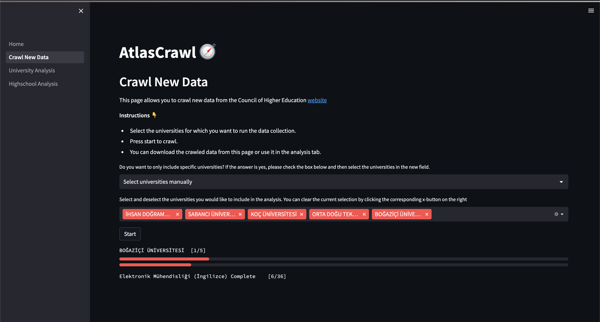
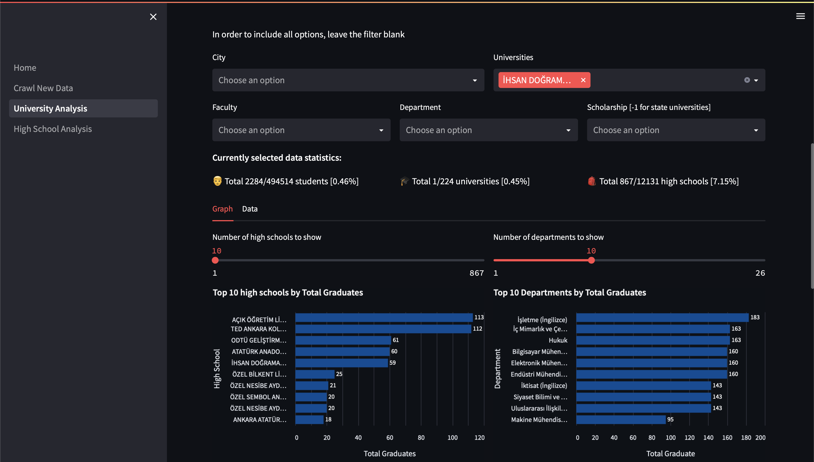

# AtlasCrawl 🧭

A [streamlit](https://streamlit.io/) based web scraping and data analytics dashboard for investigation of placement statistics across all universities in Turkey. This app is built specifically for Bilkent University's Information Office for Prospective Students.

Data is scraped from [YÖK Atlas](https://yokatlas.yok.gov.tr), a database supplied by Council of Higher Education of Turkey.

## Setup
**Requirements:**
- Python >=3.7.6
- Google Chrome installation 

First create a virtual environment and install the required packages:
```bash
python3 -m virtualenv venv
source venv/bin/activate
pip install -r requirements.txt
```

Once all of the requirements are installed, you can simply run
```bash
streamlit run Home.py
```

Bear in mind that the crawled data and the university index is not shared in this repository! You'll need to create those yourself. The university index is a tabular dataset with three columns named `UNI, UNI_ID, CITY` indicating university's name, university's YÖK ID and university's city respectively.

## Data Crawling
The data is generated on dynamic pages, therefore the scraping is done with the help of [selenium](https://www.selenium.dev/documentation/webdriver/). The pages are automatically surfed and the relevant tables are scraped and saved. You can see a screenshot below.


## Analysis Pages
The analysis pages are broken into two categories: university and high school analysis. In university analysis screen you can include universities to explore the placement data. The exploration provides top-k high schools the university received students from. You can also see a breakdown of departments that the graduates of a specific high school preferred. By default, these visualizations are presented as aggregated charts in scholarships. You can choose to see individual scholarship tiers by clicking the checbox above the chart. Also a break down of departments can be viewed in a similar format. Lastly the city distribution of the graduates is shown at the bottom of the page.
<p align="center">
  
&nbsp; &nbsp; &nbsp; &nbsp;
  
</p>

## To Do
 - [ ] Extend crawling to use multiprocessing to crawl data from multiple departments in paralel
 - [ ] A modular architecture for which tables to crawl in the department page.


